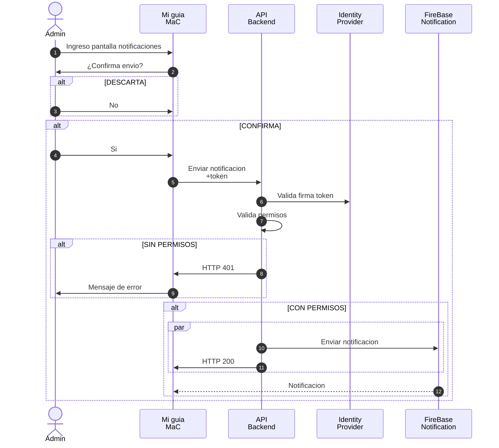

# Music As Code: *Music Festival*

El festival de música inspirada en software o “Music as Code” posee una plataforma basada en el sistema WordPress que centraliza muchas funcionalidades.

- Venta de entradas y merchandaising: sitio de ventas con conexión al Gateway de pagos de Mercado Pago
- Landing Page:  contenido de acceso publico con publicidad y noticas acerca del festival 
- "Mi guía MaC": Hay una sección del sitio que permite armar una agenda personalizada para que las personas que asisten al festival planifiquen 

## SITUACION ACTUAL

Actualmente la funcionalidad se encuentra programada en su integridad en un sitio de Wordpress. La decisión de ir con una plataforma enlatada fue simple, bajo costo. Pero la cantidad de customización realizados a la plataforma genera los siguientes problemas.

## PROBLEMAS

- Landing Page:  funciona sin ningún problema con WordPress, pero cuando hay picos en los otros elementos tiene muy baja performance y eso es malo para las métricas de marketing.
- Las ventas de entrada y merchandasing, Funciona bien en WordPress con el plugin Woocomerce pero administradores de comercialización han desconfigurado varias veces el sitio de ventas con cambios en estilos y parámetros de configuración. 
- "Mi guia MaC". Wordpress no provee la experiencia de usuario deseada. En los días del festival hay muy baja conectividad móvil y wifi, las redes se ven saturadas. Si bien la administración de WordPress es sencilla la personalización del sitio no lo es.
- Se ha considerado la opción de separar los sistemas anteriormente, pero uno de los principales problemas fue el sistema de autenticación de usuarios. Hoy con al ser un mismo sistema se mantiene un solo sistema de administración de usuarios.

## REQUERIMIENTOS

1. Independencia entre los funcionalidades 
2. Los usuarios tiene que tener un solo set de credenciales.
3. Desarrollar un nuevo sitio "Mi guia MaC"
   - Web y Mobile
   - Funcionalidad off-line. Conexiones intermitentes
   - Notificaciones push. Para envío de información de ultimo momento
   - Compatibilidad con Bluetooth Low Energy (BLE) Y BLE Beacons para ubicación sin GPS

## TAREAS

Proponga una arquitectura que solucione los problemas antes mencionados especificando

A. Identifique sub-dominios (10 puntos)
B. Diagrama estructural de contenedores según el estándar C4 (30 puntos)
C. Decisiones de arquitectura de cada sub dominio (40 puntos)
EXTRAS (DEBE TENER LOS PUNTOS A, B y C completos)
D. Diagrama de secuencia del envio de una notificacion a todos los uturios de Mi guia MaC (20 puntos)

## INFORMACION IMPORTANTE

- WORDPRESS SOPORTA OIDC CON PLUG-INS (https://plugins.miniorange.com/keycloak-single-sign-on-wordpress-sso-oauth-openid-connect)
- PUEDE UTILZIAR AUTORIZACION BASADA EN ROLES (RBAC)

# SOLUCION

## SUB-DOMINIOS
- Core
   - Portal de autogension Mi guia MaC
- Generic
   - CMS Marketing y Landing Page
   - CMS Ventas
   - Autenticacion
- Supporting
   - Administracion de Music As Code

## ARQUITECTRUA
Se ha decidido separar la solucion en 3 sitios. Landing Page, Ventas y portal "Mi guia MaC". Los tres sitios delega la autenticacion y autorizacion en el Identity Provider Keycloak que provee la identidad y roles de los usuarios. 

Todos los componente se comunican con el identity provider utilizando el estandar OIDC. No esta permitida la autenticacion fuera de este protocolo

### SEGURIDAD
Keycloak provee las funcionalidades solicitadas y algunas adicionales
- SSO entre los portales
- MFA para los usuarios administradores
- Registro de usuarios para las personas asistentes al evento
   - Auto registro: las personas asistentes al evento pueden crear su usuarios
   - Identitdades federadas, puede ser con Google, Azure, Facebook

### LANDING PAGE
CMS Marketing y Landing Page tienen su propia instancia de wordpress a fin de aislar el trafico y la administracion del sitio. Todos los usuarios se deben autenticar por medio del OIDC y no usuarios internos de WordPress

### MARKETING
CMS Marketing y Landing Page tienen su propia instancia de wordpress a fin de aislar el trafico y la administracion del sitio. Todos los usuarios se deben autenticar por medio del OIDC y no usuarios internos de WordPress

### Mi guia Mac

Es una aplicacion PWA
PWA debe checkear los roles en el token OIDC para ocultar 
- Permite recibir notificaciones por medio del  
- Tiene conexion off-line gracias a los service worker
- Funciona tanto en todas las plataformas 
- Tiene acceso a las capacidades de BLE [ver](https://github.com/WebBluetoothCG/web-bluetooth/blob/main/implementation-status.md)
- A fin de simplificar el desarrollo la administracion de Mi guia MaC tambien se encuentra en la misma aplicacion. 
- La PWA checkea el token de OIDC por el role del usuario y muestra u oculta los items de administracion.

- La autenticacion entre la PWA y la API de backend se realiza utilizando el [Autorization Code Flow de OIDC](https://datatracker.ietf.org/doc/html/rfc6749#section-1.3.1)
- Permite enviar notificaciones push por medio del servicio Firebase de Google
- La API debe verificar los permisos de usuario antes de realziar cualqueir accion.

